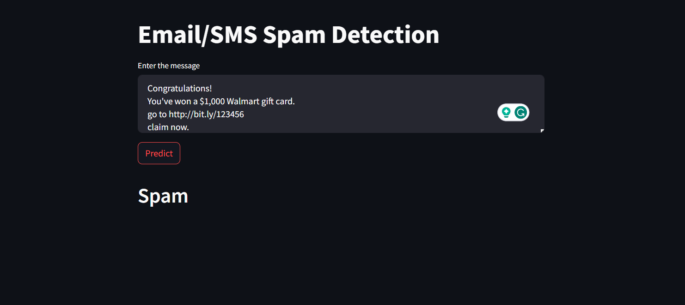

<!-- PROJECT TITLE -->
<h1 align="center">Email Spam Detection</h1>

<!-- HEADER -->
<p align="center">
  
</p>

<!-- PROJECT DESCRIPTION -->
## <br>**➲ Project description**
Email spam detection system is used to detect email spam using Machine Learning technique called Natural Language Processing and Python, where we have a dataset contain a lot of emails by extract important words and then use naive classifier we can detect if this email is spam or not.

<!-- PREREQUISTIES -->
## <br>**➲ Prerequisites**
This is list of required packages and modules for the project to be installed :
* <a href="https://www.python.org/downloads/" target="_blank">Python 3.x</a>
* Numpy
* Pandas
* Scikit-learn
* NLTK
* Streamlit

Install all required packages :
 ```sh
  pip install -r requirements.txt
  ```

<!-- THE DATASET -->
## <br>**➲ The Dataset**
* <a href="https://www.kaggle.com/datasets/uciml/sms-spam-collection-dataset" target="_blank">SMS Spam Collection Dataset</a>
It contain about 5572 records which is a sample of an email
and a target column "v1" which describe the state of an email spam or ham.<br>

<!-- CODING SECTIONS -->
## <br>**➲ Coding Sections**
In this part we will see the project code divided to sections as follows:
<br>

- Section 1 | The Data :<br>
In this section we aim to do some operations on the dataset before training the model on it,
processes like :
  1. Data Loading : Load the dataset
  2. Data Visualization : Visualize dataset features
  3. Data Cleaning : Remove stopwords and duplicates values
  4. Data Splitting : Split the dataset into training and testing sets<br><br>

- Section 2 | The Model :<br>
The dataset is ready for training, so we create a naive classifier using scikit-learn, and then fit it to the data, finally Multinomial Naive Bayes Classifier suited best with accuracy = 97.09864% and precision = 100%<br>

<!-- INSTALLATION -->
## ➲ Installation
1. Clone the repo
   ```sh
   git clone https://github.com/abhishek1959/email-sms-spam-detection.git
   ```
2. Open 'app.py' in code editor, and run the following command in the terminal
```sh
  streamlit run app.py
```
<p align="center">
  
</p>
